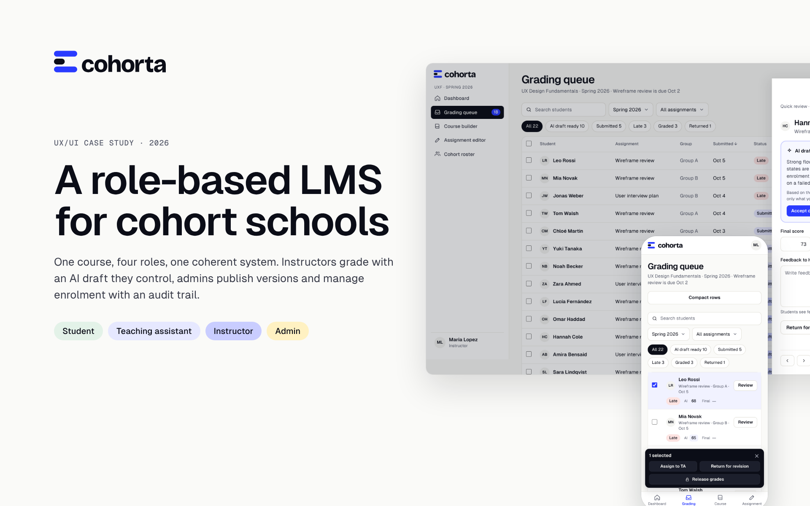

# Cohorta

A role-based LMS for cohort-based online schools. Self-initiated UX/UI case study by **Tania Aisen**.

**Live demo:** https://tanyaaisen07-uiux.github.io/cohorta
**Figma:** https://www.figma.com/design/J4J6upc1wrEXRMm6xLjisE

## Case study

All 12 case images are in [`/case`](case).

## The problem

Online schools run the same course for several cohorts at once. Students, instructors, teaching assistants and admins all work in one product, but each role needs a different home, different permissions and a different idea of "what to do next".

## What the demo shows

| Role | Key flows |
|---|---|
| Student | Course home with the next step, lesson, locked lesson, assignment upload, grades |
| Instructor | Grading queue with filters and bulk actions, quick review panel, full grading view with AI draft, course builder, assignment editor, roster |
| Admin | Overview, course review and publishing, cohort scheduling, enrolments with bulk pause and undo, users and roles with an audit log |

Use the bar at the top to switch role and page state: normal, empty, loading, error, no access.

## Key UX decisions

- **Queue first, not inbox.** Instructors grade from one queue sorted by risk and due date, with a quick review panel so they never lose their place.
- **AI drafts a grade, a person releases it.** The AI draft is visibly marked, can be accepted, edited or discarded, and nothing reaches a student without a human release.
- **Versions protect running cohorts.** Course edits go into a new version; a running cohort keeps its version until an admin pushes the update.
- **Every sensitive action is logged.** Role changes, pushes and bulk actions land in the audit log; bulk actions have undo.
- **Responsive by rule, not by shrinking.** Tablet splits grading into Document and Assessment tabs; mobile turns tables into compact rows with a fixed bulk bar.

## Accessibility

Text and status tags meet WCAG AA (status tags 12.6 to 17.2:1, primary button 6.6:1, secondary text 6.2:1). Focus states are visible, hit areas are at least 32 px, and motion respects `prefers-reduced-motion`.

## Stack

Plain HTML, CSS and JavaScript, no build step. Type: Geist. Brand assets are in `/brand`.

## Contact

- Portfolio: https://tania-aisen.framer.website/
- LinkedIn: https://www.linkedin.com/in/tania-aisen
- Behance: https://www.behance.net/tanyaaisen
